[TOC]

# 一、系统创建

## 1.1 系统环境信息

- Ubuntu 20.04 LTS


## 1.2 服务器登录

### 方式一：Xshell登录

1. 新建会话，输入**主机IP地址**和SSH端口号

   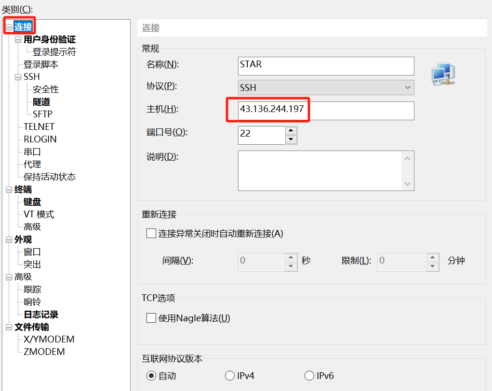

2. 切换到**用户身份验证**窗口，输入用户名和密码，用户名是star，密码是xin098

   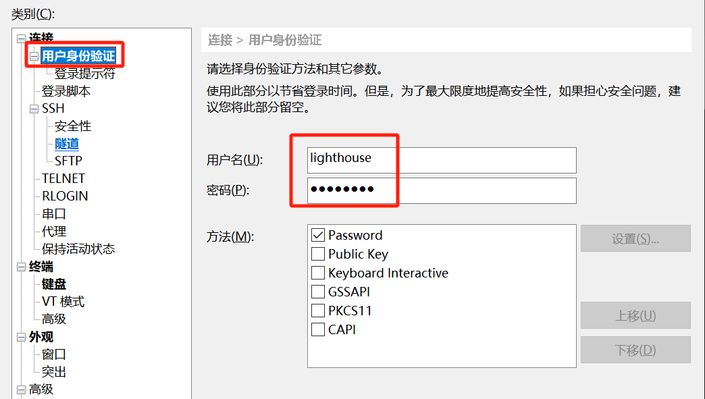

3. 点击**连接**按钮

### 方式二：VSCode登录

1. 安装Remote-SSH插件

2. 点击左侧工具栏中的**远程资源管理器**

3. 点击**新建远程**按钮

   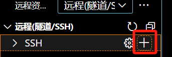

4. 在弹出的命令窗口中输入：ssh star@47.109.85.237

5. 选择第一个配置文件

   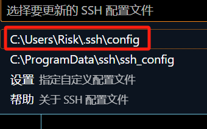

6. 点击右下角弹出的**连接**按钮

   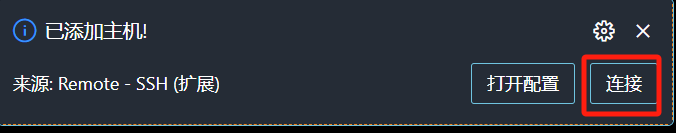

7. 选择Linux，选择继续

8. 输入密码：xin098

9. 弹出服务器终端，即登录成功

   


### 方式三：Xftp登录

1. 打开xftp软件

2. 新建连接

   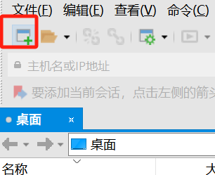

3. 输入主机IP地址，用户名和密码

   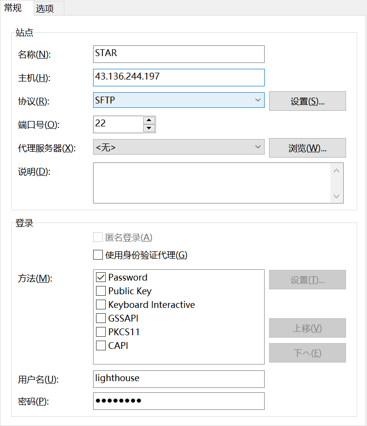

4. 点击**连接**按钮

5. 把需要上传的文件拖入到服务器即可，同理，也可从服务器下载文件到本地


# 二、搭建docker

## 2.1 安装docker

1. 通过XFTP将docker离线安装包上传到服务器，安装包位置为 /home/star/pkgs

2. 解压：tar -zxvf docker-20.10.5.tgz

3. 移动docker：sudo cp docker/* /usr/bin/

4. 通过vim编辑器编辑配置文件：sudo vim /etc/systemd/system/docker.service

5. 按下 **I** 键，切换为编辑状态，将以下内容粘贴

   [Unit]
   Description=Docker Application Container Engine
   Documentation=https://docs.docker.com
   After=network-online.target firewalld.service
   Wants=network-online.target
   [Service]
   Type=notify
   ExecStart=/usr/bin/dockerd
   ExecReload=/bin/kill -s HUP $MAINPID
   LimitNOFILE=infinity
   LimitNPROC=infinity
   TimeoutStartSec=0
   Delegate=yes
   KillMode=process
   Restart=on-failure
   StartLimitBurst=3
   StartLimitInterval=60s
   [Install]
   WantedBy=multi-user.target

6. 按下 **ESC** 键，输入 :wq! 保存编辑内容

7. 启动docker：sudo systemctl start docker

8. 通过vim编辑器配置镜像加速器：sudo vim /etc/docker/daemon.json

9. 按下 **I** 键，切换为编辑状态，将以下内容粘贴

   {

   "registry-mirrors": [

   "http://hub-mirror.c.163.com"

   ]

   }

10. 按下 **ESC** 键，输入 :wq! 保存编辑内容

11. 重启启动docker：sudo systemctl daemon-reload

12. 设置docker开机后自启：sudo systemctl enable docker.service

13. 查看docker相关信息：sudo docker info


## 2.2 配置mysql

### 服务搭建

1. 拉取mysql镜像：sudo docker pull mysql

2. 查看镜像：sudo docker images

3. 安装mysql镜像：sudo docker run -d -v /home/star/mysql:/var/lib/mysql -p 3306:3306 -e MYSQL_ROOT_PASSWORD=1204xin --restart=always --name=mysql mysql

   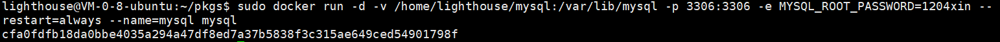

   **说明**：

   -d: 后台运行 

   -v: 将/var/lib/mysql目录挂载到/home/star/mysql 

   -p: 端口映射，本机3306，对应容器3306 

   -e: 设置root密码 

   --restart=always: 设置开机自启动

4. 检查镜像是否安装成功：sudo docker ps

   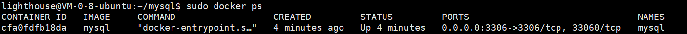

5. 进入mysql镜像：sudo docker exec -it mysql /bin/bash

6. 进入mysql数据库：mysql -u root -p

7. 输入密码：1204xin

8. 创建数据库：create database star_db;

   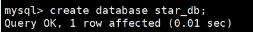

   查看数据库是否创建成功：show databases;

   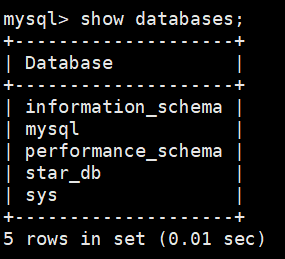

9. 赋予本地权限：GRANT ALL PRIVILEGES ON \*.\* TO 'root'@'%'  WITH GRANT OPTION;

10. 刷新权限：flush privileges; 

11. 连续两个CTRL+D，退出数据库和镜像

12. 停止mysql镜像：sudo docker stop mysql

13. 重启mysql镜像：sudo docker start mysql


### 本地客户端

1. 下载并安装dbeaver

2. 打开dbeaver

3. 新建连接

   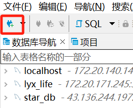

4. 选择mysql

5. 在**主要**栏中输入以下内容，密码是1204xin

   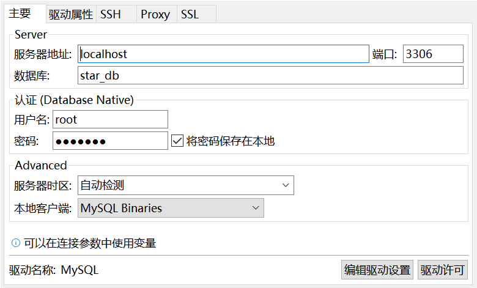

6. 在**SSH**栏中输入以下内容，密码是xin098

   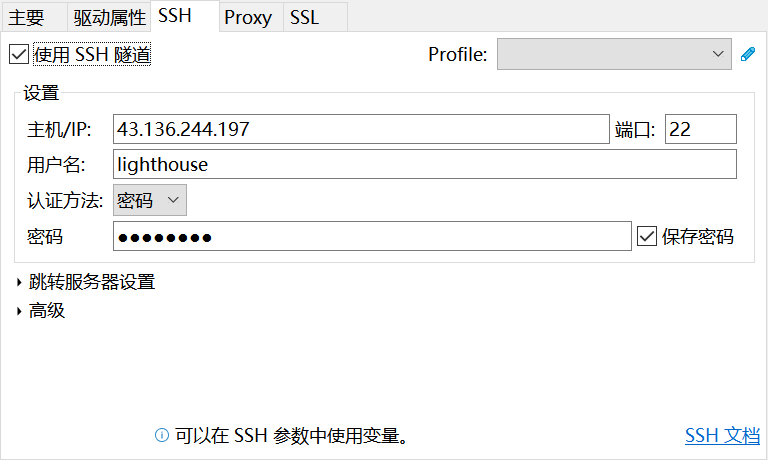

7. 连接（此时会自动下载mysql驱动）

## 2.3 配置Ngnix

1. 使用docker pull 拉取最新的 nginx 镜像

   命令：docker pull nginx

2. 启动容器

   - 先启动容器: docker run -d --name nginx-tmp nginx

   - 再在本地新建nginx运行的目录，日志目录为软连接，所以不创建logs目录

     命令：mkdir -p /root/nginx/html /root/nginx/conf

   - 然后从容器中拷贝配置文件至本地

     命令：docker cp 6a3151e3757b（镜像ID）:/etc/nginx/nginx.conf /root/nginx/conf

3. 正式部署

   正式部署完整的命令：

   docker run -d -p 8088:80 --name nginx-yoyo -v ~/nginx/html:/usr/share/nginx/html -v ~/nginx/conf/nginx.conf:/etc/nginx/nginx.conf -v ~/nginx/logs:/var/log/nginx nginx 

4. 连接测试

   本地访问，输入http://localhost:8088 即可访问到 web 服务器

   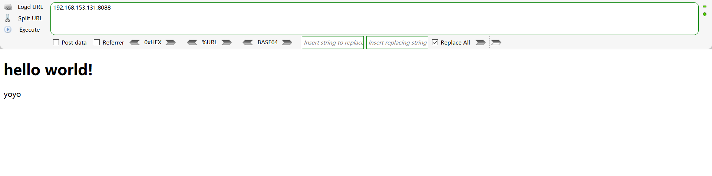

# 三、Git仓库

1. 先将仓库clone到本地
2. 将仓库目录通过XFTP上传到服务器，位置为/home/star/StarTools


# 四、搭建Conda

## 3.1 安装conda

1. 通过XFTP将conda离线安装包上传到服务器，安装包位置为 /home/star/pkgs

2. 赋予conda安装包可执行权限：chmod u+x ~/pkgs/conda-4.5.9-Linux-x86_64.sh

3. 若是centos系统，安装bzip2：sudo yum install bzip2

4. 安装conda：~/pkgs/conda-4.5.9-Linux-x86_64.sh

5. 回车，即允许安装到/home/star/conda中

6. 输入yes，即写入系统环境变量中，若不小心按了回车，则在.bashrc中添加一行：

   export PATH="/home/star/conda/bin:$PATH"

7. 更新环境变量：source ~/.bashrc

8. 检查conda是否安装成功：conda info

   

## 3.2 搭建前端框架

### 基础环境搭建

1. 创建conda虚环境：conda create -n star-front

2. 进入虚环境：source activate star-front

3. 安装nodejs：conda install nodejs

4. 检查node是否安装成功：node  --version 和 npm --version

5. 安装nrm（查看和切换镜像源）：npm install -g nrm open@8.4.2 --save

6. 查看镜像源：nrm ls

7. 使用淘宝源：nrm use taobao

8. 查看镜像源：npm get registry

9. 安装vue3：安装vue-cli

   - 命令行输入:npm install -g @vue/cli

   - 输入`vue -V`查看Vue版本号，顺便测试是否正确安装，至此Vue安装便已经完成

     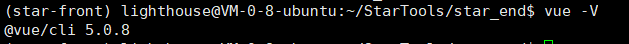

   ​	

### 创建前端项目（聂德鑫补充）

注意要创建在仓库中，即/home/lighthouse/StarTools中，前端项目名为 star_front

1. 创建前端项目

   vue create star_front

2. 根据提示选择vue3

   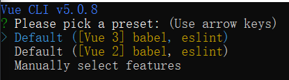

3. 根据提示进入项目：cd star_front

4. 运行项目npm run serve

   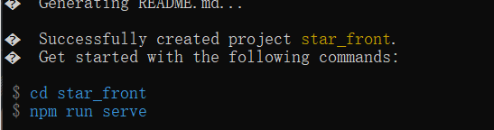

### 基础环境搭建

1. 创建conda虚环境：conda create -n star-end

2. 进入虚环境：source activate star-end

3. 安装python：conda install python=3.8.0

4. 检查python是否安装成功：python --version

5. 配置python镜像源

   ```shell
   pip config set global.index-url "https://mirrors.aliyun.com/pypi/simple/"
   python -m pip config set install.trusted-host 'mirrors.aliyun.com'
   ```

6. 安装django：pip install django


### 创建后端项目

1. 进入git仓库目录

2. 创建后端项目：django-admin startproject star_end

3. 修改settings.py, 添加允许的ip地址

   ALLOWED_HOSTS = ['47.109.85.237']

4. 运行项目：python manage.py runserver 0.0.0.0:8000

5. 本地打开浏览器，访问 47.109.85.237:8000


#  五、前后端联调

## 5.1 前端

1. 进入conda虚环境

2. 安装axios：npm install axios

3. 在前端项目中的src目录创建Api.js，内容为：

   ```shell
   import Vue from 'vue'
   import axios from 'axios'
   import router from "@/router"
   
   Vue.prototype.axios = axios
   axios.defaults.baseURL = 'http://0.0.0.0:8000'
   axios.defaults.xsrfHeaderName = 'X-CSRFToken'
   axios.defaults.xsrfCookieName = 'csrftoken'
   ```

4. 在Api.js中封装ajax函数，统一处理

   ```js
   function ajax (url, method, options, showMessage = true) {
     if (options !== undefined) {
       var { params = {}, data = {} } = options
     } else {
       params = data = {}
     }
   
     return new Promise((resolve, reject) => {
       axios({
         url,
         method,
         params,
         data
       }).then(
         res => {
           // API 正常返回(status=20x), 是否错误通过有无 error 判断
           if (res.data.error !== null && res.data.data !== null) {
             // Vue.prototype.$error(res.data.data)
             reject(res)
             // 若后端返回未登录，则 session 失效，应退出当前登录用户
             if (res.data.data.startsWith('Please login')) {
               router.push({ name: 'login' })
             }
           } else {
             resolve(res)
             if (method !== 'get' && showMessage === true) {
               // Vue.prototype.$success("Succeeded")
             }
           }
         },
         res => {
           // API 请求异常，一般为 Server error 或 network error
           reject(res)
           Vue.prototype.$error(res.data.data)
         }
       )
     })
   }
   ```

5. 编写前后端接口

   ```js
   export default {
     getToolList () {
       return ajax('toolList', 'get')
     }
   }
   ```

6. 在要展示的.vue文件中，<script>的下方引入API

   ```vue
   <script> 
   import Api from '@/Api'
   ```

7. 在.vue中使用API

   ```vue
   Api.getToolList().then(
     res => {
       console.log('res:', res.data.data)
     }
   )
   ```


## 5.2 后端

1. 进入conda虚环境

2. 创建后台管理员：python manage.py createsuperuser

3. 修改settings.py

   ```python
   INSTALLED_APPS = [
       'home',
       'django.contrib.admin',
       'django.contrib.auth',
       'django.contrib.contenttypes',
       'django.contrib.sessions',
       'django.contrib.messages',
       'django.contrib.staticfiles',
       'corsheaders'   # 新增这一行配置
   ]
   
   MIDDLEWARE = [
       'django.middleware.security.SecurityMiddleware',
       'django.contrib.sessions.middleware.SessionMiddleware',
       'corsheaders.middleware.CorsMiddleware',  # 新增这一行配置，网上都说要放在这里，所以我们也放在这里
       'django.middleware.common.CommonMiddleware',
       'django.middleware.csrf.CsrfViewMiddleware',
       'django.contrib.auth.middleware.AuthenticationMiddleware',
       'django.contrib.messages.middleware.MessageMiddleware',
       'django.middleware.clickjacking.XFrameOptionsMiddleware',
   ]
   
   CORS_ORIGIN_ALLOW_ALL = True  # 再添加这一行，允许任何域访问
   
   # 允许的请求头
   CORS_ALLOW_HEADERS = [
       'accept',
       'accept-encoding',
       'authorization',
       'content-type',
       'dnt',
       'origin',
       'user-agent',
       'x-csrftoken',
       'x-requested-with',
   ]
   # 允许的http请求
   CORS_ALLOW_METHODS = [
       'DELETE',
       'GET',
       'OPTIONS',
       'PATCH',
       'POST',
       'PUT',
   ]
   ```

4. 安装django-cors-headers库：pip install django-cors-headers

5. 创建新模块：python manage.py startapp home

6. 在settings.py中引入模块

   ```python
   INSTALLED_APPS = [
       'home',			# 新增这一行
       'django.contrib.admin',
       'django.contrib.auth',
       'django.contrib.contenttypes',
       'django.contrib.sessions',
       'django.contrib.messages',
       'django.contrib.staticfiles',
       'corsheaders'   
   ]
   ```

7. 在home/models.py中创建模型

   ```python
   from django.db import models
   
   class Tool(models.Model):
     title = models.CharField(unique=True, max_length=10, verbose_name="tool name")
     description = models.CharField(max_length=100, verbose_name="tool description")
   
     class Meta:
       verbose_name = verbose_name_plural = "tools"
       db_table = "tools_info"
   ```

8. 注册模型类（注册后，后台才能看到），修改home/admin.py

   ```python
   from django.contrib import admin
   from home.models import Tool
   
   # Register your models here.
   admin.site.register(Tool)
   ```

9. 写入数据库，执行以下两个命令

   ```shell
   python manage.py makemigrations
   python manage.py migrate
   ```

   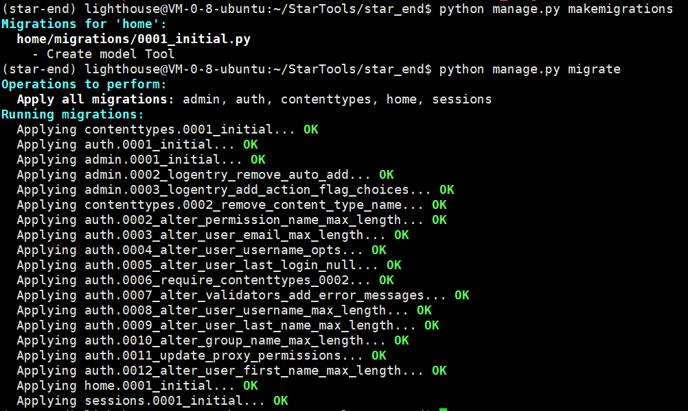

10. 进入 http://47.109.85.237:8000/admin/ 可看到新创建的模型类

11. 在urls.py中添加前后端接口

    ```python
    from home.views import ToolListAPI
    from django.urls import path
    
    urlpatterns = [
        path('toolList/', ToolListAPI.as_view(), name='tool_list'),
    ]
    ```

12. 修改home/views.py

    ```python
    from django.shortcuts import render
    
    from django.views import View
    from home.models import Tool
    from django.http import JsonResponse
    
    class ToolListAPI(View):
      def get(self, request):
        tools_info = Tool.objects.values('title','description')
        context = {
          "toolList": list(tools_info)
        }
        return JsonResponse(context)
    ```

    

## 5.3 数据库

1. 进入后端虚环境

2. 安装mysql驱动：pip install pymysql

3. 在home模块\_\_init__.py中引入驱动

   ```python
   import pymysql
   pymysql.install_as_MySQLdb()
   ```

4. 在settings.py中添加mysql数据库配置

   ```python
   # DATABASES = {
   #     'default': {
   #         'ENGINE': 'django.db.backends.sqlite3',
   #         'NAME': BASE_DIR / 'db.sqlite3',
   #     }
   # }
   
   DATABASES = {  
       'default': {  
           'ENGINE': 'django.db.backends.mysql',  
           'NAME': 'star_db',  
           'USER': 'root',  
           'PASSWORD': '1204xin',  
           'HOST': '47.109.85.237',  # 或者数据库服务器的IP地址  
           'PORT': '3306',  # MySQL默认端口是3306  
       }  
   }
   ```

5. 写入数据到数据库

   ```shell
   python manage.py makemigrations
   python manage.py migrate
   python manage.py check
   ```

6. 编写初始数据：在home模块下新建initial_data.json

   ```json
   [  
     {  
       "model": "home.Tool",   
       "pk": 1, 
       "fields": {  
         "id": 1,
         "title": "计算器",  
         "description": "111"  
       }  
     }, 
     {  
       "model": "home.Tool",  
       "pk": 2,  
       "fields": {  
         "id": 2,
         "title": "计算器2",  
         "description": "222"  
       }  
     }  
   ]
   ```

7. 命令行加载初始数据

   ```shell
   python manage.py loaddata home/initial_data.json
   ```


# 六、其他问题汇总

## 1.VSCode无法连接到远端服务器

问题描述：vscode无法正常连接到远端服务器，但是Xshell可以正常连接上，VC输出终端The remote host may not meet VS Code Server‘s prerequisites for glibc and libstdc++，并观察远程SSH日志

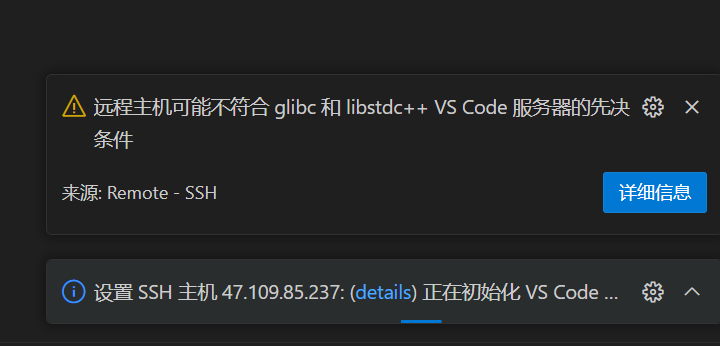

原因：VScode自动更新造成，目前不清楚原因

解决办法：最新版本为1.86，回退至1.85版本，并关闭VScode的自动更新，关闭步骤参考：[VScode 关闭自动更新方式_vscode git update.mode-CSDN博客](https://blog.csdn.net/weixin_44808483/article/details/107368154)
